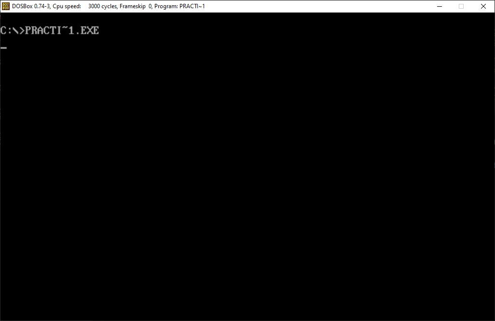
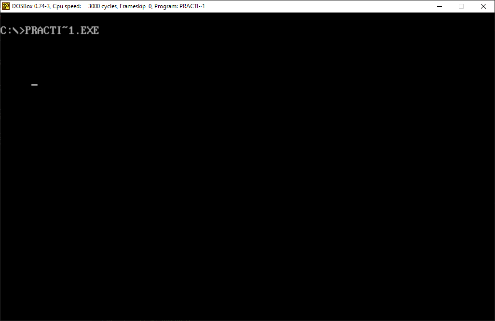
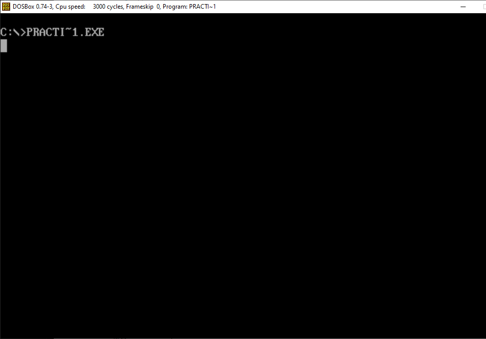
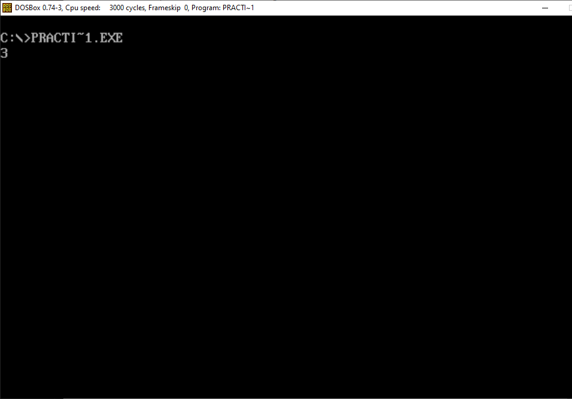
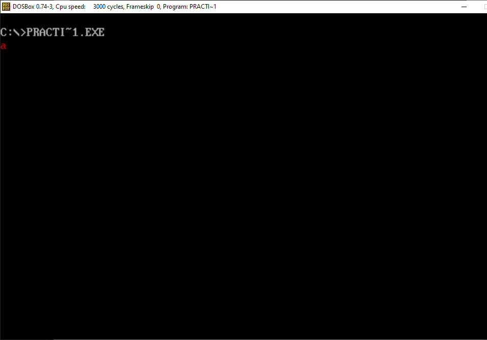
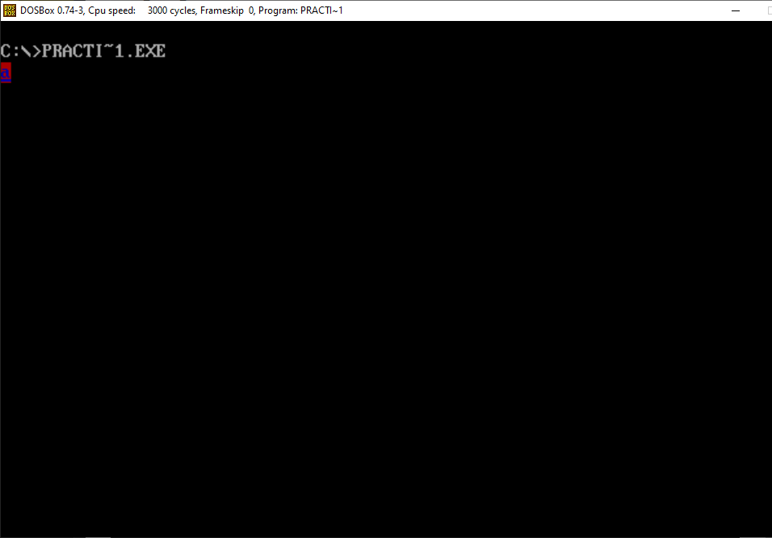

<h1>Práctica 1</h1>

Luis Miguel Aguilar González (https://github.com/laguilarg99/PDIH/)

Francisco Álvarez Terribas (https://github.com/Iqqdd99/PDIH)

<div style="text-align: justify">
Después de haber profundizado en los dos primeros seminarios quedando claro el uso de DOSBOX, su configuración y las llamadas a las interrupciones en C para E/S tenemos todas las herramientas necesarias para realizar esta primera práctica. En ella se proponen la programación de 9 funciones básicas y 2 funciones extra que cuentan con un nivel superior de dificultad.   
</div>

<h4>void mi_pausa(void);</h4>

<div style="text-align: justify">
A continuación se puede ver la función encargada de realizar una pausa antes de seguir con la ejecución del programa:
</div>

```Bash
// hace una pausa
void mi_pausa(void){
    union REGS inregs, outregs;
    inregs.h.ah = 0x00;
    int86(0x16, &inregs, &outregs);
}

```
<div style="text-align: justify">
En la siguiente captura de pantalla se puede ver como efetivamente se produce la pausa a la espera de la pulsación de una tecla:
</div>

_ _ _ _

<div style="text-align:center"></div>

_ _ _ _

<h4>void mi_gotoxy(int x, int y);</h4>

<div style="text-align: justify">
A continuación se puede ver la función encargada de mover el cursor a una posición pasada como parámetro:
</div>

```Bash
void mi_gotoxy(int x, int y){
    union REGS inregs, outregs;

    inregs.h.ah = 2;
    inregs.h.dh = x; //Posicion del cursor x
    inregs.h.dl = y; //Posicion del cursor y
    inregs.h.bh = 0;

    int86(0x10, &inregs, &outregs);
}

```
<div style="text-align: justify">
En la siguiente captura de pantalla se puede ver como efetivamente pone el cursor en la posición ejemplo (5,5):
</div>

_ _ _ _

<div style="text-align:center"></div>

_ _ _ _

<h4>void mi_setcursortype(int tipo_cursor);</h4>

<div style="text-align: justify">
A continuación se puede ver la función encargada de cambiar el tipo de cursor puduiendo seleccionar 3 diferentes (Invisible:0, Normal:1, Grueso:2):
</div>

```Bash
//establece el tipo de cursor
void setcursortype(int tipo_cursor){
    union REGS inregs, outregs;	 	 	 	 																																		
    inregs.h.ah = 0x01;
    
    switch(tipo_cursor){
        case 0: //invisible
            inregs.h.ch = 010;
            inregs.h.cl = 000;
        break;

        case 1: //normal
            inregs.h.ch = 010;
            inregs.h.cl = 010;
        break;
        
        case 2: //grueso
            inregs.h.ch = 000;
            inregs.h.cl = 010;
        break;

        default: return -1;
    }
    
    int86(0x10, &inregs, &outregs);
}

```
<div style="text-align: justify">
En la siguiente captura de pantalla se puede ver como efetivamente cambia el tipo de cursor a grueso:
</div>

_ _ _ _

<div style="text-align:center"></div>

_ _ _ _

<h4>void mi_setvideomode(BYTE modo);</h4>

<div style="text-align: justify">
A continuación se puede ver la función encargada de cambiar el modo de video al igual que en el seminario 2:
</div>

```Bash
// establece el modo de vídeo: 3-texto, 4-gráfico
void mi_setvideomode(BYTE modo){
    union REGS inregs, outregs;
    inregs.h.ah = 0x00;
    inregs.h.al = modo;
    int86(0x10, &inregs, &outregs);
}


```
<div style="text-align: justify">
En la siguiente captura de pantalla se puede ver como efetivamente cambia el modo de video:
</div>

_ _ _ _

<div style="text-align:center"></div>

_ _ _ _

<h4>int mi_getvideomode(void);</h4>

<div style="text-align: justify">
A continuación se puede ver la función encargada devolver el modo de video actual:
</div>

```Bash

// devuelve el modo 
int mi_getvideomode(){ 
    union REGS inregs, outregs;
    int videomode;
    inregs.h.ah = 0x0F; 	 	 	 																											
    int86(0x10, &inregs, &outregs);
    videomode = outregs.h.al;
    return videomode;
}


```
<div style="text-align: justify">
En la siguiente captura de pantalla se puede ver como efetivamente devuelve el modo de video:
</div>

_ _ _ _

<div style="text-align:center"></div>

_ _ _ _

<h4>void mi_textcolor(unsigned char ctexto);</h4>

<div style="text-align: justify">
A continuación se puede ver la función encargada modificar el color de texto almacenado en una variable del programa llamada _color_texto:
</div>

```Bash


// modifica el color de primer plano con que se mostrarán los caracteres
void mi_textcolor(int color){
    _color_texto = color;
}


```
<div style="text-align: justify">
En la siguiente captura de pantalla se puede ver como efetivamente cambia el color de los caracteres haciendo uso de mi_cputchar
</div>

_ _ _ _

<div style="text-align:center"></div>

_ _ _ _

<h4>void mi_textbackground(unsigned char cfondo);</h4>

<div style="text-align: justify">
A continuación se puede ver la función encargada modificar el color de fondo del texto almacenado en una variable del programa llamada _color_fondo:
</div>

```Bash


// modifica el color de fondo con el que se mostrarán los caracteres
void textbackground(int color){
    _color_fondo = color;
}


```
<div style="text-align: justify">
En la siguiente captura de pantalla se puede ver como efetivamente cambia el color de fondo de los caracteres haciendo uso de mi_cputchar además del color del texto:
</div>

_ _ _ _

<div style="text-align:center"></div>

_ _ _ _

```

<div style="text-align: justify">
Esta sería la implementación de mi_cputchar:
<div>

```Bash

    //escribe un carácter en pantalla con el color indicado actualmente
    void mi_cputchar(char letra){
        union REGS inregs, outregs;
        inregs.h.ah = 0x09;
        inregs.h.al = letra;
        inregs.h.bl = _color_fondo << 4 | _color_texto;
        inregs.h.bh = 0x00;
        inregs.x.cx = 1;
        int86(0x10, &inregs, &outregs);
        return;
    }